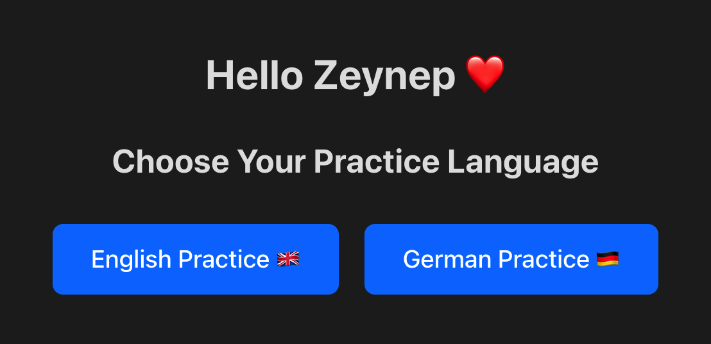

# Language Practice App

This is a simple vocabulary practice application designed to help my niece, Zeynep ❤️, with her German and English language learning. The app presents definitions and asks her to choose the correct word from a set of options.

## Overview

The main goal of this app is to provide a fun and engaging way for Zeynep to build her vocabulary in both German and English. It uses a local data file (`definitions.json`) for the word list and their translations/definitions.

## Features

*   Displays definitions (initially English, adaptable for German).
*   Requires users to select the matching word from multiple choices.
*   Provides immediate feedback on correct/incorrect answers.
*   Shows translations and definitions in a secondary language (initially Turkish, adaptable).
*   Session-based learning (10 questions per session).
*   Mobile-first responsive design.

## Getting Started

### Prerequisites

*   Node.js (v18 or later recommended)
*   npm (or yarn/pnpm)

### Installation

1.  Clone the repository:
    ```bash
    git clone https://github.com/yusufdanis/language-practice-app
    cd language-practice-app
    ```
2.  Install dependencies:
    ```bash
    npm install
    ```

### Running the Development Server

```bash
npm run dev
```

This will start the Vite development server, typically at `http://localhost:5173`.

### Building for Production

```bash
npm run build
```

This command bundles the application into the `dist` directory for deployment.

## Data Source

The vocabulary data is sourced from `public/definitions.json`. This file contains an array of objects. For English practice with Turkish translations, each object has the following structure:

```json
{
  "word_en": "EnglishWord",
  "definition_en": "English definition of the word.",
  "word_tr": "TurkishEquivalent",
  "definition_tr": "Turkish definition or explanation."
}
```

To adapt this for German practice (e.g., German words with English or Turkish translations), you would modify the structure within `definitions.json` accordingly (e.g., adding `word_de`, `definition_de`).

## How it Works

In essence:
1.  The app welcomes the user.
2.  A 10-question session starts, pulling unique definitions from `definitions.json`.
3.  For each question, a definition is shown with four word options (one correct, three incorrect, randomized).
4.  Users can select a word or "Pass".
5.  Feedback is given:
    *   **Correct:** Selected option turns green, Turkish info for the correct word is shown.
    *   **Incorrect:** Selected option turns red, correct option turns green. Turkish info for both selected and correct words is shown.
    *   **Passed:** Correct option turns green, Turkish info for the correct word is shown.
6.  After 10 questions, the user can continue with a new set of questions (scores carry over) or see their cumulative results.
7.  A "Start Again" option resets the score and begins a fresh session.


---

This project was lovingly created for Zeynep. ❤️
